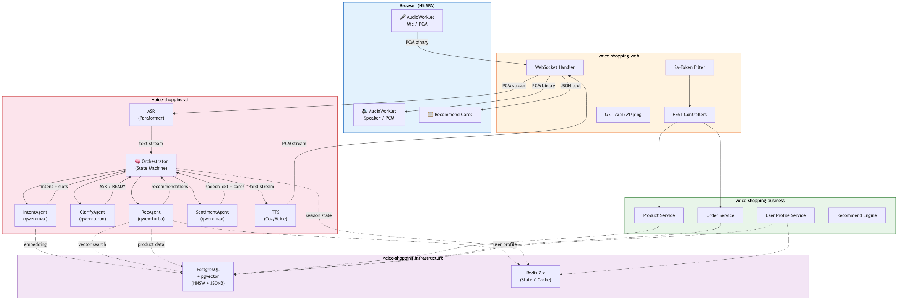

# 语音购物助手 — 系统架构文档

> 最后更新：2026-06-11

## 1. 项目概述

语音购物助手是一个基于多智能体（Multi-Agent）架构的语音购物系统。用户通过自然语言语音与 AI 助手交互，系统自动完成意图理解、需求澄清、商品推荐、情感应答等全链路操作，最终通过语音将推荐结果反馈给用户。

**核心特点：**
- 全链路流式处理：ASR → Agent → TTS，端到端延迟可控
- WebSocket 全双工通信：上行音频流 + 下行音频流同时进行
- 4 个专业 Worker Agent + 1 个 Orchestrator 状态机编排
- 多商家数据隔离：行级 `merchant_id` 过滤

## 2. 技术栈全景

| 层级 | 技术 | 版本 | 说明 |
|------|------|------|------|
| 语言 | Java | 21 | 虚拟线程支持，`--enable-preview` |
| 框架 | Spring Boot | 4.0.5 | REST + WebSocket + JPA + Cache |
| 构建 | Maven | - | 多模块，Parent POM 统一版本管理 |
| Agent 框架 | AgentScope Java | Starter 1.0.11 | 响应式架构（Project Reactor） |
| Spring AI | Spring AI Alibaba | 1.1.2.2 (BOM) | AgentScope + DashScope 集成 |
| 主对话模型 | qwen-max | - | AgentScope `DashScopeChatModel` |
| 轻量模型 | qwen-turbo | - | 推荐/排序/重排场景 |
| 向量化 | text-embedding-v3 | - | DashScope SDK 直接调用 |
| ASR | Paraformer 实时版 | - | 阿里云 NLS SDK，流式语音识别 |
| TTS | CosyVoice | - | 阿里云 NLS SDK，流式语音合成，情感可控 |
| 关系数据库 | PostgreSQL + pgvector | pgvector 0.1.6 | HNSW 索引 + JSONB 属性过滤 |
| ORM | JPA (Hibernate) + MyBatis-Plus | MP 3.5.9 | JPA 常规 CRUD，MyBatis-Plus 租户隔离 |
| 缓存 | Redis | 7.x | 对话状态、短期记忆、Sa-Token 会话 |
| 权限 | Sa-Token | 1.45.0 | `spring-boot4-starter` + `redis-jackson` |
| 监控 | Actuator + Micrometer Prometheus | - | 指标采集 + Prometheus 导出 |

## 3. 系统架构



### 3.1 整体架构图

```
┌──────────────────────────────────────────────────────────────────────┐
│                         Browser (H5 SPA)                            │
│  ┌─────────────┐    ┌─────────────┐    ┌─────────────────────────┐  │
│  │ AudioWorklet │    │ AudioWorklet│    │    Recommend Cards      │  │
│  │  (Mic/PCM)   │    │ (Speaker)   │    │                         │  │
│  └──────┬───────┘    └──────▲──────┘    └──────────▲──────────────┘  │
│         │                   │                      │                  │
└─────────┼───────────────────┼──────────────────────┼──────────────────┘
          │ PCM               │ PCM                  │ JSON
          │ (binary frame)    │ (binary frame)       │ (text frame)
          ▼                   │                      │
┌─────────────────────────────┼──────────────────────┼──────────────────┐
│                      WebSocket Handler                               │
│  ┌─────────┐  ┌─────────┐  ┌──────────┐  ┌──────────────────────┐   │
│  │  ASR    │  │   TTS   │  │  Agent   │  │   Recommend Cards    │   │
│  │(Paraformer)│  │(CosyVoice)│  │Orchestrator│  │   Push via WS        │   │
│  └────┬────┘  └────▲────┘  └─────┬────┘  └──────────────────────┘   │
│       │             │             │                                   │
│       ▼             │             ▼                                   │
│  ┌─────────┐        │    ┌─────────────────────┐                     │
│  │  Text   │        │    │  4x Worker Agents   │                     │
│  │ Stream  │────────┼───▶│  IntentAgent        │                     │
│  │         │        │    │  ClarifyAgent       │                     │
│  │         │        │    │  RecAgent           │                     │
│  │         │        │    │  SentimentAgent     │                     │
│  │         │        │    └──────────┬──────────┘                     │
│  │         │        │               │                                │
└──┼─────────┼────────┼───────────────┼────────────────────────────────┘
   │         │        │               │
   ▼         │        │               ▼
┌──────────────────────────────────────────────────────────────────────┐
│                        Infrastructure Layer                          │
│  ┌──────────────────┐  ┌──────────────────┐  ┌──────────────────┐   │
│  │  PostgreSQL       │  │  Redis 7.x       │  │  DashScope API   │   │
│  │  + pgvector       │  │  (State/Cache)   │  │  (Embedding)     │   │
│  │  (Products/Users/ │  │                  │  │                  │   │
│  │   Orders/Vector)  │  │                  │  │                  │   │
│  └──────────────────┘  └──────────────────┘  └──────────────────┘   │
└──────────────────────────────────────────────────────────────────────┘
```

### 3.2 数据流

```
用户语音 → WebSocket 上行(PCM binary frame)
         → ASR(Paraformer) 转文本(streaming)
         → Orchestrator 接手
         → MsgHub 派发给对应 Agent
         → Agent 读 PostgreSQL/pgvector/Redis
         → 结果回 Orchestrator
         → SentimentAgent 包装(口语化话术 + 展示卡片)
         → TTS(CosyVoice) 流式合成(PCM)
         → WebSocket 下行(PCM binary frame)
         → 用户耳朵
```

关键约束：**每一层只做一件事，严格通过 `Msg` 对象通信，不越界。**

| 层 | 职责 | 不做什么 |
|----|------|----------|
| WebSocket Handler | 音频帧路由、JSON 控制消息分发 | 不做业务决策 |
| ASR (Paraformer) | PCM → text（流式） | 不理解语义 |
| Agent (Orchestrator + Workers) | 业务决策、数据读写 | 不直接操作 WebSocket |
| TTS (CosyVoice) | text → PCM（流式） | 不生成内容 |
| Infrastructure | 数据存储 | 不含业务逻辑 |

## 4. 模块划分

```
voice-shopping/
├── pom.xml                              # Parent POM — 统一版本管理
├── docs/                                # 架构文档
├── voice-shopping-common/               # 公共工具、常量、DTO
│   └── com.voiceshopping.common
│       ├── constant/                    # 全局常量
│       ├── dto/                         # 跨模块传输对象
│       ├── enums/                       # 枚举定义
│       └── util/                        # 工具类
├── voice-shopping-infrastructure/       # 基础设施层
│   └── com.voiceshopping.infrastructure
│       ├── config/                      # DB/Redis 配置 (RedisConfig)
│       ├── repository/                  # 数据访问 (JPA + MyBatis-Plus)
│       └── vector/                      # pgvector 向量检索
├── voice-shopping-ai/                   # AI 能力层
│   └── com.voiceshopping.ai
│       ├── agent/                       # AgentScope ReActAgent 实现
│       ├── model/                       # LLM 配置 (AgentScopeConfig)
│       ├── asr/                         # Paraformer 流式 ASR
│       ├── tts/                         # CosyVoice 流式 TTS
│       └── orchestrator/                # Orchestrator 状态机
├── voice-shopping-business/             # 业务服务层
│   └── com.voiceshopping.business
│       ├── product/                     # 商品服务
│       ├── order/                       # 订单服务
│       ├── user/                        # 用户画像服务
│       └── recommend/                   # 推荐引擎
└── voice-shopping-web/                  # 通信接口层（启动模块）
    └── com.voiceshopping.web
        ├── controller/                  # REST Controller (HealthController)
        ├── websocket/                   # WebSocket Handler
        ├── config/                      # Sa-Token / CORS 配置
        └── filter/                      # 过滤器
```

**依赖方向（严格单向，禁止反向和循环）：**

```
web → business → ai → infrastructure → common
```

## 5. Agent 架构

### 5.1 Orchestrator 状态机

手写 Service 级状态机，不走 AgentScope pipeline，显式调用、显式分支各 Worker Agent。

```
                    ┌─────────────────────────────────────────────┐
                    │                                             │
                    ▼                                             │
 ┌──────┐    ┌──────────────┐    ┌────────────┐    ┌──────────────────┐
 │ IDLE │───▶│INTENT_PARSED │───▶│ CLARIFYING │───▶│READY_TO_RECOMMEND│
 └──▲───┘    └──────┬───────┘    └─────┬──────┘    └────────┬─────────┘
    │               │                  │                     │
    │               │                  │ (ASK → loop)        │
    │               │                  └─────────────────────┘
    │               │
    │               ├── PRODUCT_RECOMMENDATION ──▶ ClarifyAgent → RecAgent → SentimentAgent
    │               ├── PRODUCT_COMPARE ─────────────────────────▶ RecAgent → SentimentAgent
    │               ├── CLARIFY_NEEDED ──────────────────────────▶ ClarifyAgent (loop)
    │               ├── ORDER_CONFIRM ──────────────────────────────────────▶ Order Flow
    │               ├── CHITCHAT ──────────────────────────────▶ SentimentAgent
    │               └── OUT_OF_SCOPE ─────────────────────────▶ SentimentAgent (polite decline)
    │
    └── GENERATING_SPEECH (TTS streaming) ──────────────────────┘
```

### 5.2 Worker Agent 契约

| Agent | 职责 | 模型 | 输入 | 输出 |
|-------|------|------|------|------|
| **IntentAgent** | 意图理解 | qwen-turbo | userId, sessionId, utterance, recentHistory | intent, slots, confidence |
| **ClarifyAgent** | 需求澄清（规则优先，LLM 兜底） | qwen-turbo | slots, category | action(ASK/READY), questionToAsk |
| **RecAgent** | 商品推荐 | qwen-turbo | slots, userProfile | recommendations[], matchScore |
| **SentimentAgent** | 情感问答 | qwen-max | recommendations, userUtterance, sessionMood | speechText, displayBlocks[] |

**意图枚举：** `PRODUCT_RECOMMENDATION` / `CLARIFY_NEEDED` / `PRODUCT_COMPARE` / `CHITCHAT` / `ORDER_CONFIRM` / `OUT_OF_SCOPE`

### 5.3 Agent 交互示例

**场景：用户说"我想买双跑鞋，预算500以内"**

```
1. IntentAgent:
   输入: "我想买双跑鞋，预算 500 以内"
   输出: { intent: PRODUCT_RECOMMENDATION, slots: { category: "跑鞋", budget: 500 }, confidence: 0.91 }

2. ClarifyAgent:
   输入: { slots: { category: "跑鞋", budget: 500, scenario: null }, category: "跑鞋" }
   输出: { action: ASK, questionToAsk: "平时跑塑胶跑道、水泥路、还是都有？" }

3. 用户回答: "水泥路"

4. ClarifyAgent:
   输入: { slots: { category: "跑鞋", budget: 500, scenario: "水泥路" } }
   输出: { action: READY }

5. RecAgent:
   输入: { slots: {...}, userProfile: { height: 180, weight: 75 } }
   输出: { recommendations: [{ productId: 8821, name: "Asics GEL-Contend 9", price: 479, ... }] }

6. SentimentAgent:
   输入: { recommendations: [...], userUtterance: "我想买双跑鞋", sessionMood: "neutral" }
   输出: { speechText: "好，给你挑了三款缓震很出色的……", displayBlocks: [...] }
```

## 6. 全双工音频流设计

### 6.1 WebSocket 协议

| 帧类型 | 方向 | 格式 | 用途 |
|--------|------|------|------|
| Binary | Client → Server | PCM 16bit 16kHz mono | 麦克风音频流 |
| Binary | Server → Client | PCM 16bit 16kHz mono | TTS 合成音频流 |
| Text | Client → Server | JSON | 控制消息（开始/停止录音） |
| Text | Server → Client | JSON | ASR 中间结果、推荐卡片、状态通知 |

### 6.2 流式管道

```
Mic ──PCM──▶ WebSocket ──▶ ASR ──text──▶ Agent ──text──▶ TTS ──PCM──▶ WebSocket ──▶ Speaker
              (binary)     (streaming)    (streaming)     (streaming)     (binary)
```

三段流式处理（ASR/Agent/TTS）以管道方式串联，不等待前一段完全结束才启动后一段。ASR 产出中间文本时即可触发 Agent 推理，Agent 产出文本片段时即可触发 TTS 合成。

## 7. 数据架构

### 7.1 PostgreSQL + pgvector

| 数据类型 | 存储方式 | 说明 |
|----------|----------|------|
| 商品基础信息 | 关系表（JSONB 属性） | 名称、价格、品类、品牌、规格参数 |
| 商品向量 | `vector(1024)` 列 | text-embedding-v3 语义向量 |
| 商家信息 | 关系表 | 多商家入驻 |
| 用户画像 | 关系表 + JSONB | 身高、体重、偏好、历史购买 |
| 订单 | 关系表 | 订单主表 + 订单明细 |

**向量检索模式：**

```sql
-- HNSW 向量检索 + JSONB 属性过滤
SELECT id, name, price, attributes
FROM product
WHERE attributes @> '{"category": "跑鞋"}'::jsonb
  AND price <= 500
ORDER BY embedding <=> $query_vector
LIMIT 20;
```

### 7.2 Redis 缓存策略

| Key Pattern | 用途 | TTL |
|-------------|------|-----|
| `session:{sessionId}:state` | Orchestrator 当前状态 | 30min |
| `session:{sessionId}:history` | 对话历史摘要 | 30min |
| `session:{sessionId}:slots` | 当前轮次槽位数据 | 30min |
| `user:{userId}:profile` | 用户画像缓存 | 24h |

## 8. 权限与数据隔离

### 8.1 Sa-Token 认证

- 登录后签发 Token（UUID 风格，存 Redis）
- WebSocket 连接时通过 Query 参数或 Header 携带 Token 验证
- 多商家模式：每个商家一个独立账号

### 8.2 数据隔离策略

**行级隔离：** 每张业务表加 `merchant_id` 字段，通过 MyBatis-Plus 租户插件自动注入 WHERE 条件。

```java
// 自动注入: WHERE merchant_id = #{currentMerchantId}
// 业务代码无感知，SQL 层面保证数据隔离
```

## 9. 配置管理

### 9.1 配置文件结构

| 文件 | 职责 | 是否提交 VCS |
|------|------|-------------|
| `application.yml` | 框架配置 + 环境变量占位 | ✅ 提交 |
| `.env` | 敏感配置（DB密码、API Key） | ❌ gitignored |

### 9.2 环境变量

| 变量 | 说明 | 示例 |
|------|------|------|
| `DB_URL` | PostgreSQL 连接地址 | `jdbc:postgresql://localhost:5432/voice_shopping` |
| `DB_USER` | 数据库用户名 | `postgres` |
| `DB_PASSWORD` | 数据库密码 | - |
| `REDIS_PASSWORD` | Redis 密码 | - |
| `DASHSCOPE_API_KEY` | DashScope API 密钥 | `sk-xxx` |

### 9.3 启动流程

```bash
# 1. 配置敏感信息
cp .env .env.local  # 编辑填入真实值

# 2. 启动基础设施（PostgreSQL + Redis）
# 确保 PostgreSQL 和 Redis 已运行

# 3. 启动应用
source .env.local && export DB_URL DB_USER DB_PASSWORD REDIS_PASSWORD DASHSCOPE_API_KEY
mvn spring-boot:run -pl voice-shopping-web

# 4. 验证
curl http://localhost:8080/api/v1/ping
# {"app":"voice-shopping","status":"ok","ts":1712345678901}
```

## 10. 监控与可观测性

| 维度 | 工具 | 端点 |
|------|------|------|
| 应用健康 | Spring Boot Actuator | `/actuator/health` |
| 业务指标 | Micrometer + Prometheus | `/actuator/prometheus` |
| JVM 指标 | Micrometer | 内存、GC、线程 |
| HTTP 请求 | Micrometer | 请求量、延迟、错误率 |
