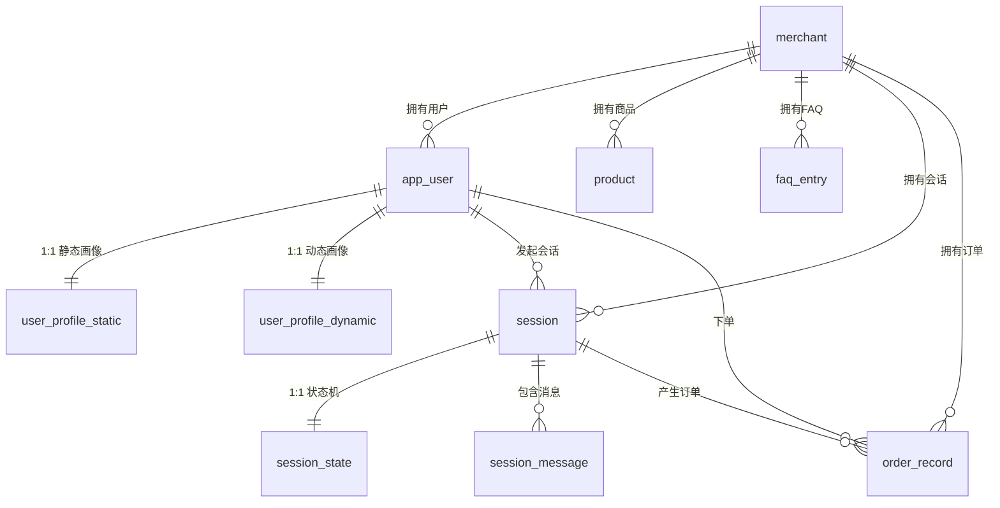

# ER 关系图 — 语音购物系统

## 表关系图

## 关系汇总

| 父表 | 子表 | 基数 | 外键列 |
|------|------|------|--------|
| merchant | app_user | 1:N | app_user.merchant_id |
| merchant | product | 1:N | product.merchant_id |
| merchant | faq_entry | 1:N | faq_entry.merchant_id |
| merchant | session | 1:N | session.merchant_id |
| merchant | order_record | 1:N | order_record.merchant_id |
| app_user | user_profile_static | 1:1 | user_profile_static.user_id (UNIQUE) |
| app_user | user_profile_dynamic | 1:1 | user_profile_dynamic.user_id (UNIQUE) |
| app_user | session | 1:N | session.user_id |
| app_user | order_record | 1:N | order_record.user_id |
| session | session_state | 1:1 | session_state.id (PK = FK, UUID) |
| session | session_message | 1:N | session_message.session_id (CASCADE) |
| session | order_record | 1:N | order_record.session_id |

## 多租户隔离

所有业务表携带 `merchant_id` 字段，通过 MyBatis-Plus 租户插件实现行级数据隔离。例外：`merchant` 表本身是租户根节点，无此字段。

## 级联删除

- 删除 `session` 时级联删除 `session_message` 和 `session_state`（ON DELETE CASCADE）。
- 其他关系通过应用层逻辑管理生命周期。

## 删除策略

| 表 | 策略 |
|----|------|
| merchant | 软删除（`deleted_at`） |
| app_user | 软删除（`deleted_at`） |
| product | 软删除（`deleted_at`） |
| faq_entry | 硬删除 |
| user_profile_static | 硬删除 |
| user_profile_dynamic | 硬删除 |
| session | 硬删除（通过 TTL 清理） |
| session_message | 硬删除（跟随 session 级联） |
| session_state | 硬删除（跟随 session 级联） |
| order_record | 永不删除（金融记录） |
